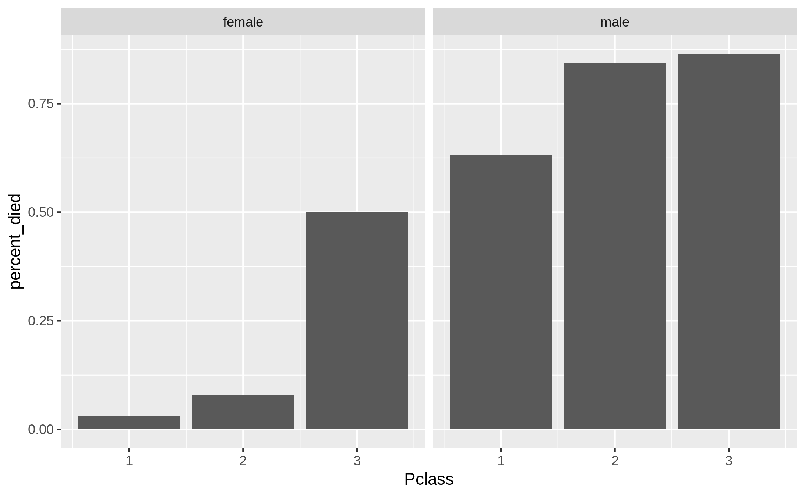
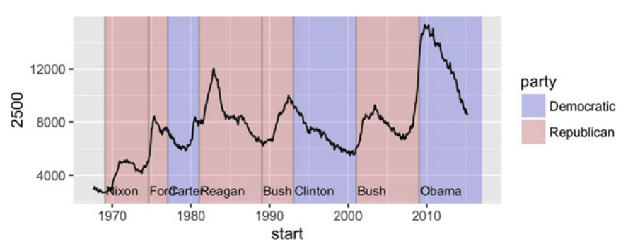

```{r setup, include=FALSE}
knitr::opts_chunk$set(echo = TRUE,comment = '#>',error=TRUE, results = 'hold', out.width='70%', fig.align = 'center')
```

基本題 (共 100 分)
=====================

## 視覺化死亡率 (共 40 分)

```{r message=FALSE}
# 請勿更動此 code chunk 程式碼
library(dplyr)
library(ggplot2)

# 上週作業使用到的 titanic data
titanic <- readr::read_delim("titanic-passengers.csv", 
                             delim = ";", 
                             escape_double = FALSE, 
                             trim_ws = TRUE)
# 上週作業 `分組摘要` 的結果
died_summary <- titanic %>% 
  group_by(Sex, Pclass) %>%
  summarise(percent_died = mean(Survived == "No")) %>%
  ungroup()
died_summary 
```

此題延續上週作業關於鐵達尼號乘客死亡率的[分組摘要](https://rlads2019.github.io/hw6-draft/index.html#q2)。上方的程式碼即是上週分組摘要的答案，儲存於 `died_summary`。你的任務是使用 `ggplot2` 將 `died_summary` 繪製成[此長條圖](#bar-chart):

```{r}
# Write your code here
```

<div class="alert alert-success hint">
1. 如果不知道如何下手，請先閱讀 [R for Data Science 第三章](https://r4ds.had.co.nz/data-visualisation.html)
1. 你應該會使用到 `geom_bar()` 或是 `geom_col()`
1. 你應該會使用到 `facet_wrap()`
1. 輸出結果應與下圖相同：

{#bar-chart .half}
</div>


## 自己的資料自己畫 (共 60 分)

請自行尋找一份資料 (不得使用 `titanic-passengers.csv`)，將其放在此次作業的 repo 並命名為 `mydata.csv` (副檔名請根據自己的資料而定, e.g., 若為 tab 分隔檔，請命名為 `mydata.tsv`)。你的任務是將這份資料讀入並使用 ggplot2 視覺化這份資料。

1. (10 分) **資料讀取與清理**  
將 `mydata.csv` 讀入並進行資料清理 (如果需要的話)，以利接下來的資料視覺化

2. (30 分) **資料視覺化**  
請依這份資料的特性以及你想觀察的現象，對這份資料進行視覺化。依據你的喜好，你可以畫任意多張圖，但**其中一張圖裡「必須」使用到 2 種或 2 種以上的 `geom_*()` 函數** (助教也只會依據這張圖評分)。這些 `geom_*()` 的使用需合理。例如，下方的例子雖然仍畫得出圖，但顯然是不合理的，這種情況將不予給分：
    ```{r}
    ggplot(iris) +
      geom_bar(aes(x = Species)) +
      geom_point(aes(Sepal.Length, Petal.Width))
    ```

3. (20 分) **Tweak the plot**  
請依據你的個人偏好「修改」於 `2.` 所繪製出來的圖。例如，你可以使用某個 [`coord_*()`][coord_func] 將圖的 x、y 軸對調；使用其它的[風格][theme]；或是修改與新增圖的[座標軸名稱與標題][scales]等。
    - 評分標準：你只要合理地使用到 <https://ggplot2.tidyverse.org/reference/index.html> 當中 [Scales][scales], [Coordinate systems][coord_func] 或是 [Themes][theme] 這三個段落之內的**任意一個**函數即可得分。


[coord_func]: https://ggplot2.tidyverse.org/reference/index.html#section-coordinate-systems

[theme]: https://ggplot2.tidyverse.org/reference/index.html#section-themes

[scales]: https://ggplot2.tidyverse.org/reference/index.html#section-scales

<div class="alert alert-success hint">
若覺得題目說明不夠清楚，可以參考[此題的範例](https://rlads2019.github.io/hw7-draft/Q2_example.html)。
</div>


### 資料讀取與清理 {-}

```{r}
# Write your code here

# 請務必印出 data frame
```

### 資料視覺化 {-}

```{r}
# Write your code here

# 請務必印出圖片
```

### Tweak the plot {-}

```{r}
# Write your code here

# 請務必印出圖片
```


進階選答題 (共 20 分)
=====================

本週我們已經學習如何利用ggplot套件來對資料做各式各樣的視覺化處理。

然而，ggplot除了可以針對不同資料型態來繪製圖表，更能客製化地利用不同的視覺功能來清楚地繪製「不只一份」資料在同一張畫布(canvas)上，亦即將多份資料的內容層層疊加於同一張圖表。

本題你需要對「兩份資料」進行視覺化，為其"metadata"做清楚的標註，最終輸出為一張圖表。

**進階選答題四小題分段給分，但最後的code寫在同一個chunk內即可。**

請依序回答以下問題。


1. (5分)  
`ggplot2` 內建有資料集 economics，其中變項`date`的觀察值是以每月一號為起始點，一個月為一個區間。變項`unemploy`則是失業人口數。

    請讀取資料集 economics，將`date`與`unemploy`繪製成一個二維折線圖，其中`date`為X軸（以預設值「十年」為一區間），`unemploy`為Y軸（以預設值「4000人」為一區間）。

2. (5分)  
除了時間軸和失業率之外，也可以為這份資料添加背景訊息以及文字說明。作法上，有時候甚至可以**加入其他的資料集**來幫助我們完成這個任務，同時**利用多個圖層（在程式碼中使用`+`建立多層圖層）**，來讓視覺呈現更豐富、更清楚。

    因此，在同一張繪布（`ggplot()`）上，我們要加入 `ggplot2` 的另一個內建資料集 presidential，此資料集內含有 2017 年前美國歷任總統的上任與卸任日期，以及其所屬黨派。

    請讀取資料集 presidential，新增一個圖層，將剛剛的圖表依照「黨派」為X軸的時間做「區塊上色」。

    注意：為了不讓折線圖被區塊色蓋過，請設定區塊透明度為0.2，以清楚顯示折線。


3. (5分)  
新增第二個圖層，畫出每個總統任期的區間垂直線，顏色設為grey50，透明度是0.5。


4. (5分)  
再新增第三個圖層，加上總統名字的文字標註，X軸為任期開始時間點，水平位置在Y軸是2500處（此數值無實質意義，為作圖標示用）。


```{r}
# 請勿更動以下程式碼
presidential <- subset(presidential, start > economics$date[1])

# write your code here
ggplot() + # 建立繪布
  + # 「黨派」區塊上色
  + # 「任期區間」垂直線
  + # 「總統名字」文字標記
  geom_line() +  # 劃出第1.小題的折線圖（為了讓折線置於最上方，因此此行程式碼在各個 geom 的最後面）
  scale_fill_manual(values = c("blue", "red")) # 此行程式碼請勿更動
```


{#bar-chart .half}

**提示：**  
你可以用Layer:geoms內含的多個functions試試，本題會使用到的有`geom_rect`, `geom_text`, `geom_vline`, `geom_line`，但不一定要使用這些 geom 來製圖，其他的方式也可以。
（參考：https://ggplot2.tidyverse.org/reference/index.html#section-layer-geoms）

